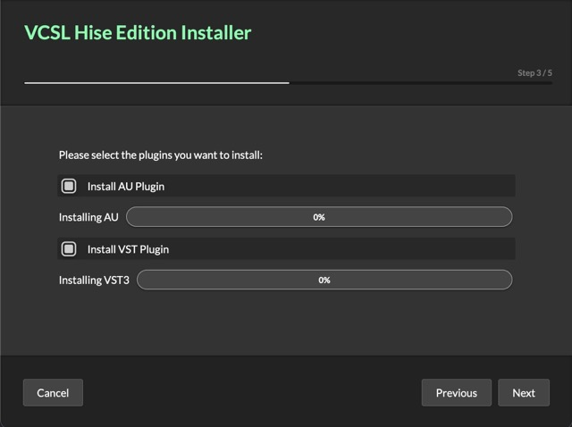

## How to use the installer



This directory contains the files necessary to build an installer with the MultiPageCreator and the DMGCanvas file for creating a DMG image on macOS. The installer will perform these actions for you:

- install the plugins to the default location on macOS (and let you choose the VST3 folder on Windows)
- download the sample archive from the Github Release page using a static URL
- extract the samples from the HR1 archive to a customizable location
- write the sample folder to the LinkFile in the app data folder

### macOS

1. Compile the VST3 and AU version of the plugin
2. Load the `installer.json` file in the multipage creator
3. **File -> Export as Projucer Project**. It should pickup the HISE folder from your HISE settings. If you want to codesign the installer with your Apple Developer team ID, supply it here.
4. Open the `dmg/VCSL.dmgcanvas` file in DMGCanvas 4.0+. Click build and finalize.

### Windows

1. Compile the VST3 and AU version of the plugin
2. Load the `installer.json` file in the multipage creator
4. **File -> Export as Projucer Project**. It should pickup the HISE folder from your HISE settings. 

### How to transfer this to your project

Copy over the entire `Installer` folder, then edit the `installer.json` file and change the `Properties` object at the top to match your project info:

```json
"Properties": {
    "Header": "{PROJECT}",
    "Subtitle": "",
    "ProjectName": "{PROJECT}",
    "Company": "{COMPANY}",
    "Version": "{VERSION}",
    "BinaryName": "VCSL Hise Edition Installer",
    "UseGlobalAppData": false,
    "Icon": "${icon}"
  }
```

`{PROJECT}`, `{COMPANY}` and `{VERSION}` must match the values in your `project_info.xml` file. As next step, you need to search for the DownloadTask item and change the URL to match wherever you store the samples:

```json
{
  "Type": "DownloadTask",
  "Text": "Download ",
  "EventTrigger": "OnSubmit",
  "Source": "https://linktoyoursamples.hr1",
  "Target": "$sampleArchive"
},
```

> Note that this assumes that you are hosting the samples somewhere statically.

The rest of the JSON file will pickup these variables, so unless you want to customize the appearance or add additional functionality, you should be good to go. From there, just repeat the steps listed above to create your installer.

> Note that if you want to test the installer on macOS, you need to copy the plugin files and sample data into this directory so that the installer can pick them up.

### Commandline

the MultiPageCreator can also be run from the command line in order to fully automate the build process. I've added a `build.sh` shell script that will build the plugins, create the installer and codesign all binaries so that you can simply run the DMGCanvas image creation from the app (this last step could also be automated but I prefer the UX of the app for this last step).